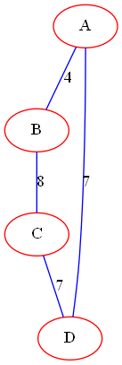

# How to use Graphviz with C++ on Windows/MacOS
### Configuration
 1. Install Graphviz for [Windows](https://graphviz.org/download/#windows)/[MacOS](https://graphviz.org/download/#mac) and remember the installation path. In my case it is "C:\\Program Files\\Graphviz".
 2. Next we need to add the libraries (files from "Graphviz\\lib") and its includes ("Graphviz\\include\\graphviz") to a project.
 #### Windows
 3. Open CMakeLists.txt and define the location of our library using the "set" command. Replace "C:/Program Files/Graphviz" with your path.
 ```cmake 
set(GRAPHVIZ_DIR "C:/Program Files/Graphviz") 
```
4. Add the libraries and includes
 ```cmake
file(GLOB GVC_LIBS "${GRAPHVIZ_DIR}/lib/*.lib")
target_link_libraries(${CMAKE_PROJECT_NAME} ${GVC_LIBS})
include_directories("${GRAPHVIZ_DIR}/include/graphviz")
```

#### MacOS
3. Open CMakeLists.txt and define the location of our library using the "set" command. Replace "/usr/local/Cellar/graphviz/2.50.0" with your path. <br/>The path depends on the way you installed the graphviz and its version. If it is installed using Homebrew, it can be found in "/usr/local/Cellar/" folder.
```cmake
set(GRAPHVIZ_DIR "/usr/local/Cellar/graphviz/2.50.0")
```
4. Add the libraries and includes
 ```cmake
file(GLOB GVC_LIBS "${GRAPHVIZ_DIR}/lib/*.dylib")
target_link_libraries(${CMAKE_PROJECT_NAME} ${GVC_LIBS})
include_directories("${GRAPHVIZ_DIR}/include/graphviz")
```
---
You will end up with a CMake file similar to this


### Application
0. To save graphs w/o specifying an absolute path add a working directory. In CLion: Run -> Edit Configuration -> Working directory.
1. Create a graph object. You can check an example in the project folder (made by [@jcarrasquel](https://github.com/jcarrasquel)).
2. Add a modified ```graph2img``` header file to your project
2. Use the ```printImage()``` method and pass a filename, extension, and the graph:
```C++
    MyGraph graph;
    buildGraph(graph);
    MyGraph mst = kruskal(graph);

    printImage("output", "png", graph);
```
> **_NOTE:_** <br/>
To get a dot file use the "gv" extension
4. Run the code



